# Lab 5 Summary – Metasploit & Pivoting

## Objective
This lab focused on using Metasploit for obtaining access to a vulnerable machine, executing a reverse shell, exploring internal networks, and performing privilege escalation and persistence.

## Tools & Environment
- Kali Linux
- lab-msf VM
- Metasploit Framework
- Wireshark
- ProxyChains
- Jupyter Notebooks
- EVE-NG (for simulated network)

## Key Steps

### Initial Access
- Identified the target VM IP (192.168.36.162) via packet capture and Nmap scan.
- Used `scanner/http/http_login` module with default user/pass lists.
- Successfully brute-forced HTTP login using `admin:Password`.
- Verified access via the admin panel and executed commands (`ps aux`, `whoami`, etc.).

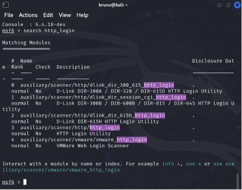

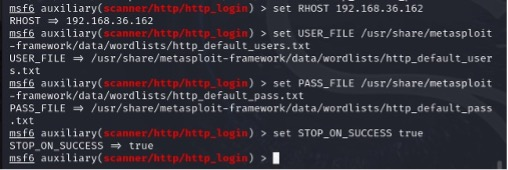

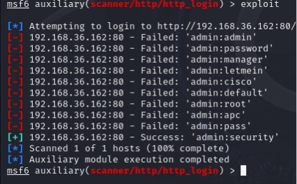

### Reverse Shell
- Set up Netcat listener on Kali.
- Generated reverse shell payload via revshells.com.
- Established shell access using Python one-liner.
- Upgraded session to Meterpreter for advanced capabilities (e.g., `hashdump`, `screenshot`).

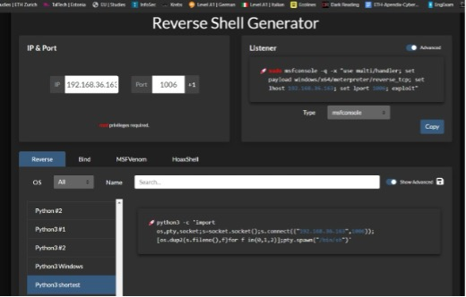

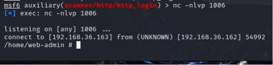

### Pivoting Technique
- Used `autoroute` in Meterpreter to enable internal routing.
- Configured SOCKS proxy and ProxyChains.
- Scanned 192.168.10.0/24 network via `nmap` through proxy.
- Discovered multiple hosts with SSH/HTTP open.
- Set up port forwarding and established SSH access to 192.168.10.20.

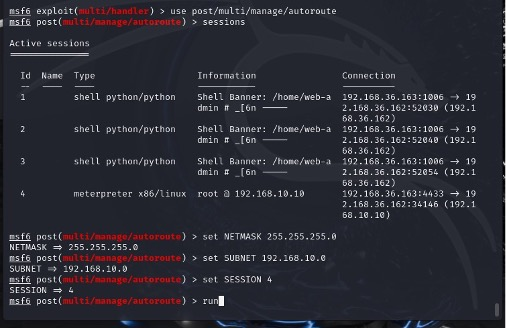

### Internal Enumeration
- Identified OpenSSH version.
- Used CVE to enumerate users, then brute-forced access.
- Found `user:P@ssw0rd` credentials.
- Read sensitive file once logged in.

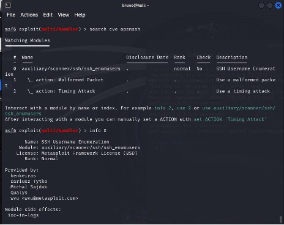

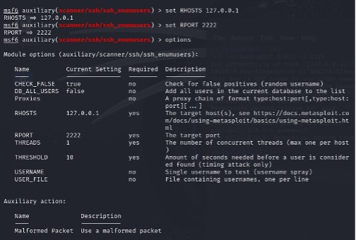

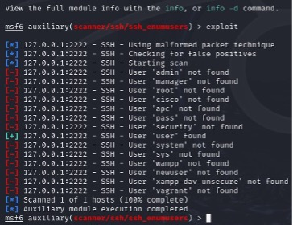

### Persistence
- Used `post/linux/manage/adduser` to create a privileged user `paolo`.
- Added SSH public key for passwordless login.
- Verified sudo access and command privileges.

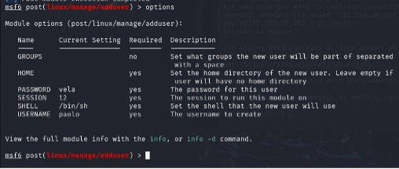

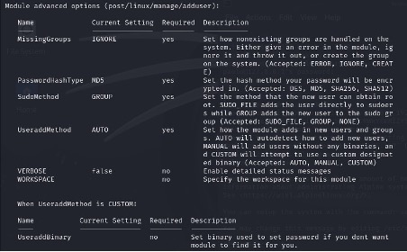

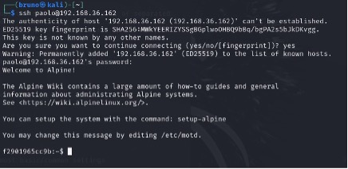

## Conclusion
This lab demonstrated full attack lifecycle: reconnaissance, exploitation, post-exploitation (pivoting, internal scanning), and establishing persistence. The use of Metasploit's automation and ProxyChains for lateral movement exemplifies real-world Red Team techniques.
