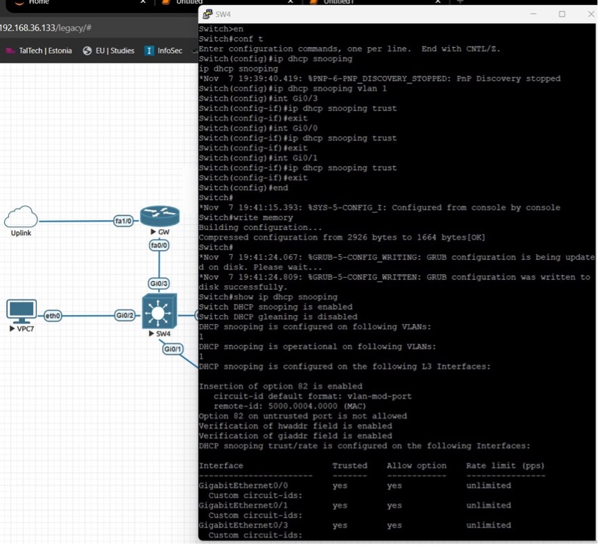

# Lab 4 Summary – Layer 2 Security with Scapy

## Objective
This lab focused on simulating Layer 2 attacks and implementing protective measures using Scapy, Jupyter, and network switch configurations.

## Tools & Environment
- Cisco Switches (SW1-SW5)
- Linux Server with Scapy and Jupyter
- EVE-NG
- VPC hosts
- DHCP, ARP, STP protocols

## Key Sections

### Topology Setup
- Internal network configured with GW1 (192.168.6.1) and VPCs.
- Static and DHCP IP assignments.
- NAT and ACL rules on router for Internet access.

### DHCP Protection
- DHCP starvation simulated with Scapy script.
- Rogue DHCP server attempt tested.
- Enabled DHCP snooping on switches to block fake DHCP offers.
- Port security configured to limit MAC addresses.

### ARP Protection
- ARP spoofing simulated using Scapy.
- Dynamic ARP inspection enabled on VLAN 1.
- Trusted ports defined; ARP spoofing attempts blocked.

### STP Protection
- STP attack simulated by changing root bridge via malicious packets.
- BPDU filter enabled on access ports to prevent external STP influence.

## Conclusion
Layer 2 security is critical for protecting against internal threats. The lab demonstrated real attack scenarios and effective switch-level protections using Scapy and Cisco features.
